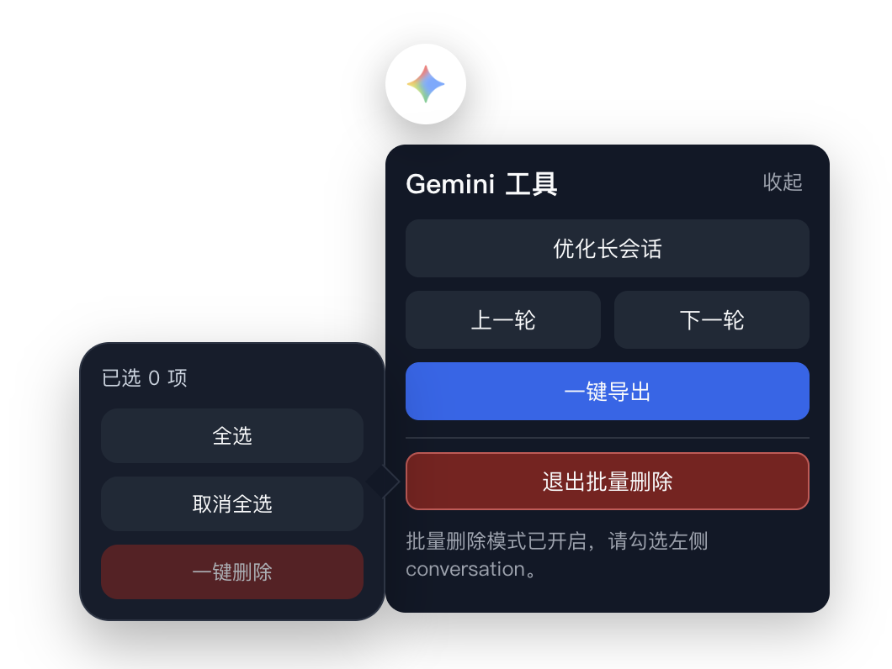

# ChatGPT & Gemini Chrome Toolkit

Browser extension for ChatGPT and Gemini with long-chat optimization, previous/next user-turn navigation, JSON export, and bulk conversation delete.

Built for long AI chat workflows: ChatGPT/Gemini long conversation optimization, chat history navigation, previous-turn jump, bulk conversation delete, and one-click current conversation export. It also targets common Chinese search intents such as `ChatGPT长历史上下文优化`、`长对话优化`、`上一轮对话跳转`、`conversation 批量删除`、`当前会话一键导出` and `Gemini 对话增强`.

## Features

- Auto-fold long conversations on page load and keep only the latest 5 user rounds visible by default
- Fold older turns again at any time with `Fold Convs`
- Expand older history upward with `Unfold [x]`, where `x` is a positive integer
- Jump to the previous or next visible user turn
- Export the current conversation as JSON
- Bulk delete sidebar conversations that are currently rendered
- Use the same floating toolkit UI on ChatGPT and Gemini

## Supported Sites

- `https://chatgpt.com/*`
- `https://chat.openai.com/*`
- `https://gemini.google.com/*`

## Install

1. Open `chrome://extensions/` or `edge://extensions/`
2. Enable `Developer mode`
3. Click `Load unpacked`
4. Select this folder: `chatgpt-Long-conversation-optimization`

## Toolkit Actions

- `Fold Convs`: keep only the latest 5 rounds visible and hide older conversation rounds
- `Unfold [x]`: expand `x` more hidden rounds upward, defaulting to `5`
- `上一轮 / 下一轮`: jump by user turns instead of scrolling through long assistant replies
- `一键导出`: export the full current conversation as JSON, including folded content
- `批量删除 conversation`: select rendered sidebar conversations and remove them in bulk

## What This Fork Adds

- Gemini support with the same floating toolkit experience
- Previous / next user-turn navigation
- Integrated bulk-delete workflow inside the main popup
- Refined checkbox UI and confirmation flow for batch delete
- Draggable floating icon with anchored popup behavior

## Credits

This project is based on:

- [bujue3709/chatgpt-Long-conversation-optimization](https://github.com/bujue3709/chatgpt-Long-conversation-optimization)

It also integrates bulk-delete ideas and workflow from:

- [qcrao/bulk-delete-chatGPT](https://github.com/qcrao/bulk-delete-chatGPT)

Thanks to both original authors for the foundation of this project.
